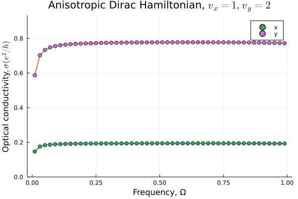
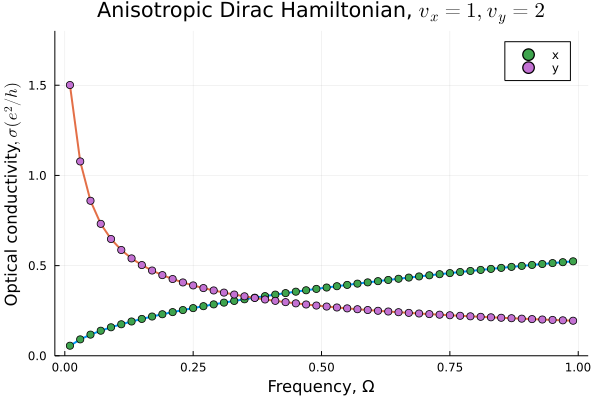
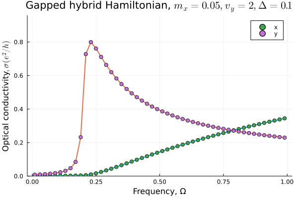

# Optical conductivity
This Julia code calculates interband contribution to the optical conductivity for a hybrid anisotropic Hamiltonian of the form
```math
H({\bf k}) = \begin{pmatrix} 0 & \Delta + \frac{\hbar^2k_x^2}{2m_x}+\frac{\hbar^2k_y^2}{2m_y} \\
                             \Delta + \frac{\hbar^2k_x^2}{2m_x}+\frac{\hbar^2k_y^2}{2m_y}  & 0 \end{pmatrix} +
\begin{pmatrix} V & \ \hbar v_x k_y - i\hbar v_y k_y\\
                              \hbar v_x k_y + i\hbar v_y k_y & -V \end{pmatrix},
```
where the first term in r.h.s. describes two quadratic anisotropic bands separated by a gap $\Delta$, and the second term corresponds to an anisotropic Dirac Hamiltonian, where a sublattice (pseudospin) splitting $V$ is introduced. The conductivity is computed using the Kubo formula in the independent-particle approximation at zero temperature,
```math
\begin{equation}
\sigma_{ii}(\Omega) = ie^2\hbar\int  \frac{d{\bf k}}{(2\pi)^2} \frac{1}{\varepsilon_{2\bf k} - \varepsilon_{1\bf k} } \frac{\langle \psi_{1{\bf k}}|v_i| \psi_{2{\bf k}}\rangle \langle \psi_{2{\bf k}} |v_i| \psi_{1{\bf k}} \rangle}{\varepsilon_{2\bf k} - \varepsilon_{1\bf k} - \Omega - i\eta },
\end{equation}
```
where $ii = xx, yy$, and $v_i({\bf k}) = \hbar^{-1}\partial H({\bf k})/ \partial k_i$. The result is provided in units of $e^2/h$ per spin per valley. The input parameters are read from the file ```conf.toml``` in atomic units ($\hbar=1, m_0=1$). The output is written in the human-readable file ```conductivity.dat```.

## Examples
* _Quadratic Hamiltonian_: $v_x,v_y=\infty$, $V=0$. If the second term in r.h.s. of the Hamiltonian is absent, the velocity operator in the basis of the Hamiltonian eigenvalues is diagonal, providing no contribution to the interband conductivity. Therefore, in this case
```math
\sigma_{xx}=0 \text{   and   } \sigma_{yy}=0
```
 for any $m_x, m_y, \Delta$.
* _Anisotropic Dirac Hamiltonian_: $m_x,m_y=\infty$, $\Delta=0$, $V=0$. In this case, the interband conductivity is simply given by
```math
\sigma_{xx}(\Omega) = \frac{v_x}{v_y}\frac{\pi}{8}\frac{e^2}{h}
\text{   and   }
\sigma_{yy}(\Omega) = \frac{v_y}{v_x}\frac{\pi}{8}\frac{e^2}{h},
```
which is reproduced in the figure below.

 

 * _Semi-Dirac Hamiltonian_: $v_x=0$, $m_y=\infty$, $\Delta=0$, $V=0$. In this case we deal with a gapless dispersion that is quadratic along $x$ and linear along $y$. Analytical expressions for the conductivity in this case read
```math
\sigma_{xx}(\Omega) = \frac{e^2}{h} \sqrt{\frac{\Omega}{m_xv_y^2}}\frac{1}{5G}
\text{   and   }
\sigma_{yy}(\Omega) = \frac{e^2}{h} \sqrt{\frac{m_x v_y^2}{\Omega}}\frac{\pi G}{6},
```
where $G\approx0.835$ is the Gauss' constant. The result of numerical calculations is given below.

 

 * _Gapped hybrid Hamiltonian_: $v_x=0$, $m_y=\infty$, $\Delta \neq 0$, $V=0$. In this situation, there is no simple analytical expression for the conductivity. Numerical calculations result in the following dependencies.

 
